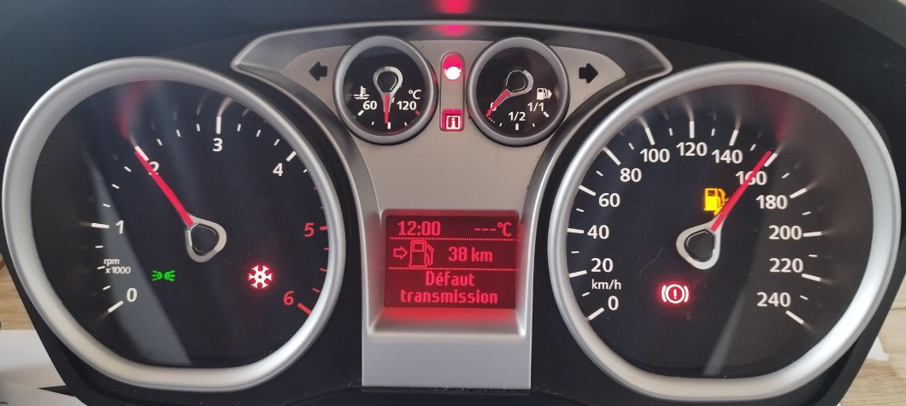
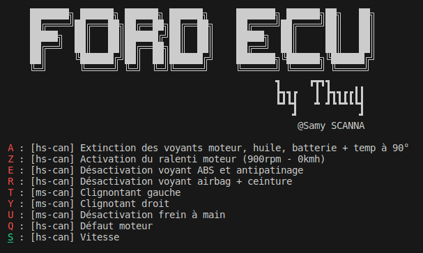

# PyFordECU
Python Ford ECU simulator to send CAN frames to a Ford Kuga Intrument Cluster with two **WaveShare USB-CAN-A**.

# Introduction
**ecu_ford.py** is a Python script designed to interact with a CAN (Controller Area Network) bus via two serial interfaces (Waveshare USB-CAN-A), generally used for communication in vehicles. 
It allows pre-defined commands to be sent over the CAN bus according to the keyboard keys pressed by the user.

# Dependencies
The script uses the following modules:

**serial**: For serial communication with Waveshare USB-CAN-A key.

**time**: For pauses and delays required for CAN operations.

**pynput**: To detect keyboard keys pressed by the user.

**threading**: For independant sending of multiple CAN frames.

**signal**, **sys**, **termios**, **atexit**, **select**: For various system functions and terminal management.

# Configuration
The script uses two **Waveshare USB-CAN-A keys**, whose documentation is available at https://www.waveshare.com/wiki/USB-CAN-A.

Two keys because the **Instrument Cluster** works with two CAN buses called MS-CAN (Medium Speed - 125kbps) and HS-CAN (High Speed - 500 kbps).

Each CAN bus carries information on the management of indicator lights, speed and RPM counter needles, temperature and fuel level gauges, and much more...

For each BUS (MS and HS), it is therefore necessary to specify the access path to the serial link (usbtty0/1).

# Running script
Install all necessary dependencies with **pip install xxxx**, then run the script with **SUDO rights** BUT :

Use **sudo -E ford_ecu.py**, the **-E** allows you to preserve the user environment for superuser execution, as the dependencies are installed for the current user and not root.
